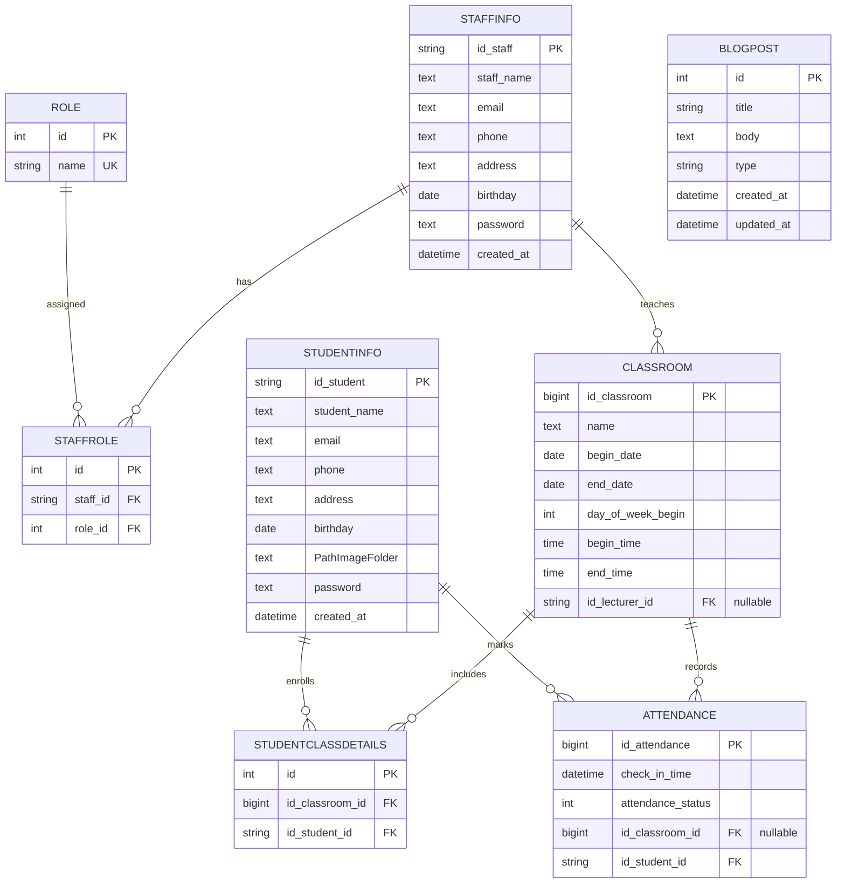

# ERD (Entity Relationship Diagram)

Sơ đồ này được suy ra trực tiếp từ các Django models trong `main/models.py`.

## Ghi chú
- `StaffInfo` ↔ `Role` là quan hệ N-N thông qua bảng trung gian `StaffRole`.
- `Classroom` ↔ `StudentInfo` là quan hệ N-N thông qua bảng trung gian `StudentClassDetails`.
- `Attendance.id_classroom` là FK nullable (SET_NULL), nên một bản ghi điểm danh có thể tồn tại ngay cả khi lớp bị xoá/không gán.
